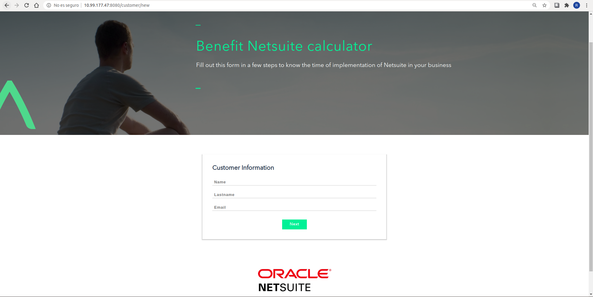
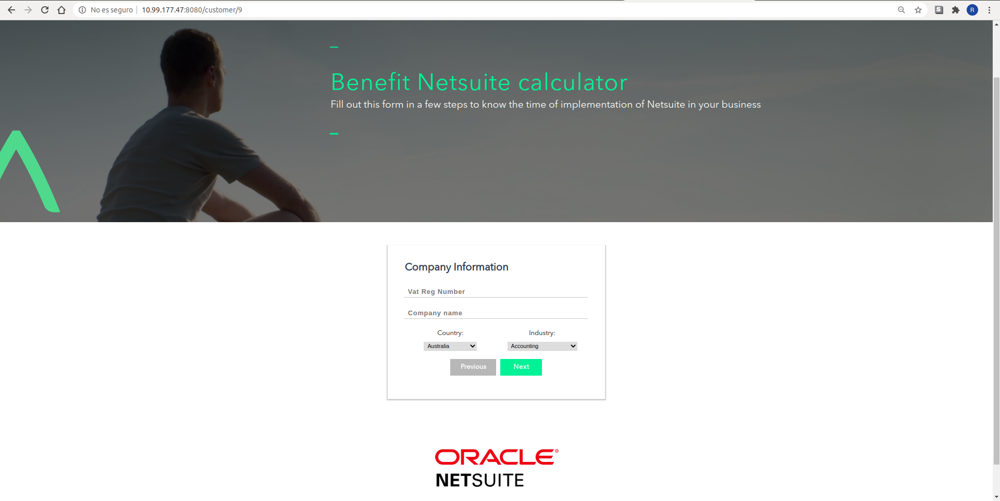
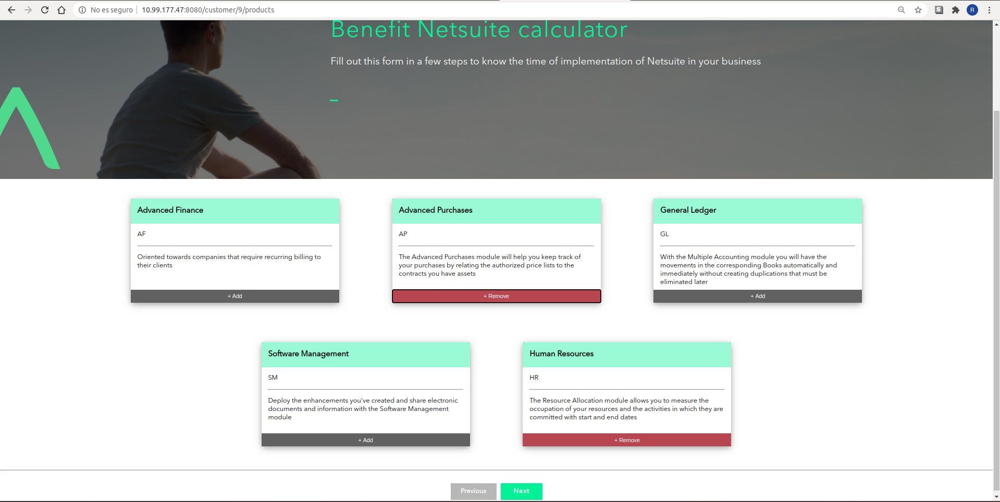
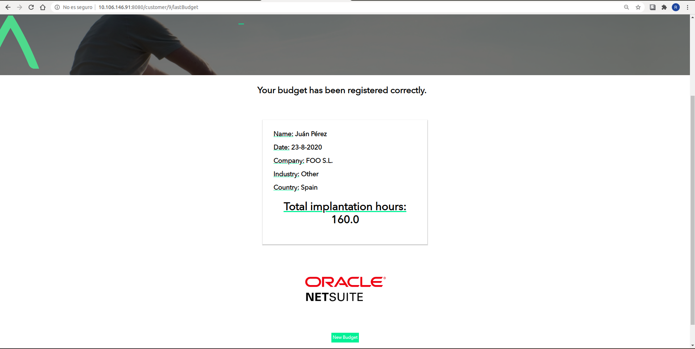

# API WEB - TFM-SPRINGBOOT

### [Go to repository](https://github.com/Rubru94/tfm-springboot)

## NEW CUSTOMER

_Initial customer registration form_

* #### METHOD: GET

* #### URL:  http://{url}:{port}/customer/new 

* #### TEMPLATE: _newCustomer.html_

	

## SAVE NEW CUSTOMER

_Save a new customer_

* #### METHOD: POST

* #### URL:  http://{url}:{port}/customer 

## CUSTOMER

_Client form where we will select the company data_

* #### METHOD: GET

* #### URL:  http://{url}:{port}/customer/{id}  

* #### TEMPLATE: _customer.html_

## SAVE COMPANY INFO

_Save company data associated with customer_

* #### METHOD: POST

* #### URL:  http://{url}:{port}/customer/{id}/company

## PRODUCT

_Product selection form_

* #### METHOD: GET

* #### URL:  http://{url}:{port}/customer/{id}/products 

* #### TEMPLATE: _product.html_

## SAVE NEW BUDGET

_Save a new customer budget_

* #### METHOD: POST

* #### URL:  http://{url}:{port}/customer/{id}/budget

## LAST BUDGET

_Budget data summary_

* #### METHOD: GET

* #### URL:  http://{url}:{port}/customer/{id}/lastBudget

* #### TEMPLATE: _budget.html_

### [Go to repository](https://github.com/Rubru94/tfm-springboot)