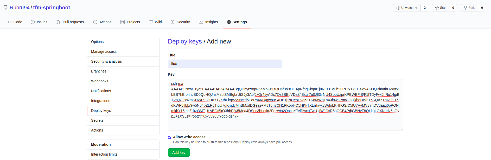
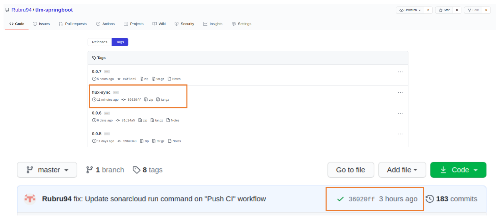
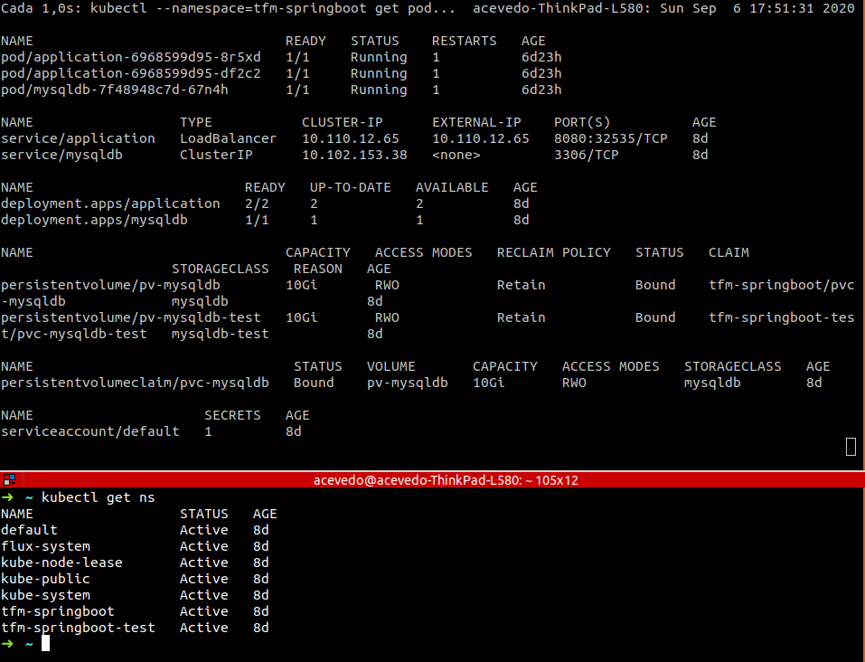

[**Flux**](https://fluxcd.io/) is described as a GitOps operator for Kubernetes that synchronises the state of manifests in a Git repository to what is running in a cluster.
This tool runs in the cluster, to which updates would be applied, and its main function is watching a remote Git repository to apply changes in Kubernetes manifests.


## Requirements

- **Helm**, that will allow you to package and manage your *Kubernetes* applications. Version equal to or greater than v3.1.1.

- **fluxctl**, on version equal to or greater than v1.19.0, which will allow us to access the *FluxCD* service installed in the *Kubernetes* cluster.

***

The logical grouping of the repository will be based on *namespaces*, which will be those that we will also find in the *Kubernetes* cluster where the application is deployed.

The following *namespaces* are currently available:

- **flux-system**: Pods and services that are enabled with [*Flux* installation](../script/flux_install.sh), including *helm-operator*.

- **tfm-springboot**: **PRODUCTION** environment where application and the associated *MySQL* database are deployed. We will indicate in *deployment annotations* from file [**application.yml**](../namespaces/tfm-springboot/application.yml), *Flux* configuration related to automatic update of application images. In this case semantic versioning.

```
...
    metadata:
  	name: application
  	namespace: tfm-springboot
  	annotations:
    	  fluxcd.io/automated: "true"
    	  fluxcd.io/tag.tfm-springboot: semver:~0.0
...
```

- **tfm-springboot-test**: **TEST** environment where application and the associated *MySQL* database are deployed. Application images will be updated manually, using:

```
sudo fluxctl release --workload=${NAMESPACE}:deployment/${APP_NAME} -n ${NAMESPACE} --k8s-fwd-ns ${NAMESPACE} --update-image=${DOCKER_IMAGE_NAME}:${VERSION}
```

***

## Installation

File [**flux_install.sh**](../script/flux_install.sh) contains all settings to install *Flux*, and we must highlight some specifications such as:


    --set sync.interval=2m

Which sets the synchronization interval (reconciliation cycle) of the cluster with the GitHub repository.

    --set memcached.hostnameOverride=flux-memcached.flux-system

Flux stores used images tags in cache

***

To install Flux in our cluster, we must execute this [script]((../script/flux_install.sh)) with indicated settings or modifying those that were necessary.

After *Flux* installation is complete, a key will be required to establish communication between *Flux* and GitHub repository. We can obtain it with following instruction:

```
sudo fluxctl identity --k8s-fwd-ns flux-system
```

This will return an *ssh* key that we must add as a **deploy key** in the *GitHub* repository. Also, we will have to activate the *Allow write access* option.



Once the deploy key is validated, we must synchronize *Flux* with the repository, executing the following instruction:

```
sudo fluxctl sync --k8s-fwd-ns flux-system
```

When the synchronization finishes, a release will automatically be created in the *GitHub* repository that will always point to latest commit.



At that time the cluster will be updated and we can see that we have all the deployments and namespaces that the repository has.



In case of deleting a deployment by mistake, *Flux* in its reconciliation period, set in this case to 2 minutes, will detect that the state of the cluster does not match that of the repository, and will reestablish it.

## Performance

*Flux* will guarantee the automation of the deployment through semantic versioning, updating the cluster and the *GitHub* repository, each time that a version higher than the previous one is added to the image repository.

The image [repository](https://hub.docker.com/repository/docker/rubru94/tfm-springboot) chosen for the project is ***Dockerhub***, a free public cloud store provided by *Docker* for finding and sharing multiple container images.


When [CI *release* workflow](../.github/workflows/release.yml) runs, it will build and publish the latest application version on Dockerhub.

As soon as *Flux* detects a new higher version release than the one currently running in the cluster, it will be in charge of deploying it immediately, keeping the application in latest version constantly.

If deployed image is removed, it will rollback and automatically return to the immediately previous version.
