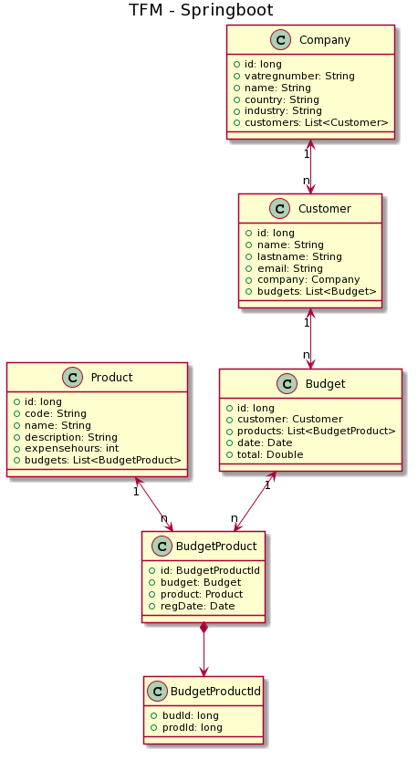

## UML diagram that describes the entities that make up the application

To have a relationship between the entities "Product" and "Budget", so that a product can be part of several budgets and a budget can contain several products, an intermediate entity "BudgetProduct" has been implemented that relates said records and also includes the date of entry of these to the table.

