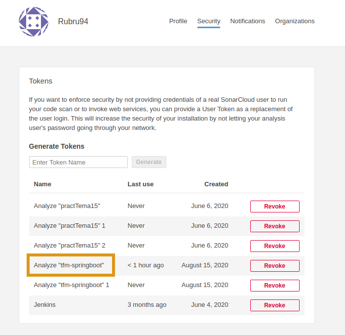
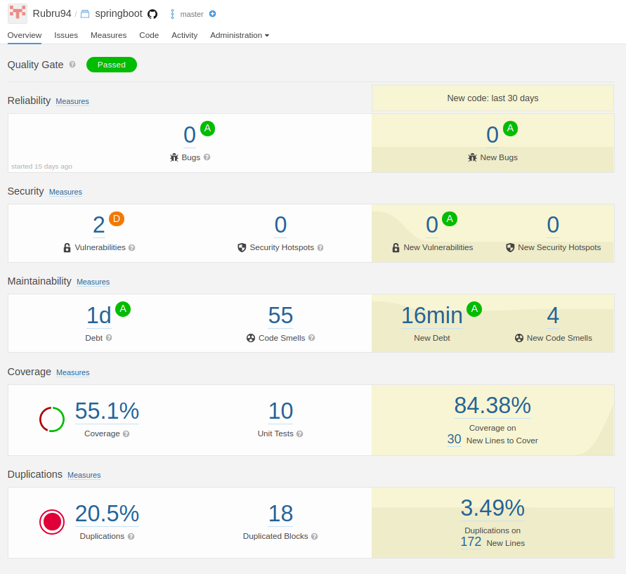

In order to maintain a quality source code, it is necessary to regularly examine our code, knowing how many potential bugs, vulnerabilities, code smells, and other factors such as the percentage of test coverage or duplicate code.

For this purpose, [***SonarCloud***](https://sonarcloud.io/) tool has been used in this project.


To start using *SonarCloud*, we do not need any type of previous installation, we will only have to log into the website by selecting our remote repository. We can use **SonarCloud free version** only with **public repositories**.

It was decided to dispense with the automatic analysis option that *Sonar* offers, because in CI environment we define when analysis will be executed.

To do this, it is necessary to generate an identification token from Sonar that we will use in our repository.



```
...  
    - name: Analyze with SonarCloud
      run: mvn -B -DskipTests verify sonar:sonar -Dsonar.projectKey=Rubru94_tfm-springboot
	-Dsonar.organization=rubru94 -Dsonar.host.url=https://sonarcloud.io
	-Dsonar.login=$SONAR_TOKEN
      env:
        GITHUB_TOKEN: ${{ secrets.GITHUB_TOKEN }}
        SONAR_TOKEN: ${{ secrets.SONAR_TOKEN }}
...
```

***

Once synchronization is done, from the SonarCloud dashboard we can examine details of last analysis:



In order for coverage to be reflected in the SonarCloud analyzes, it was necessary to add a **Jacoco** dependency, which works correctly if *Sonar verify* instruction is launched from a terminal, but which has not been possible to integrate with *GitHub* Actions.

As a consequence coverage tab in analysis will appear at 0% after each CI execution
