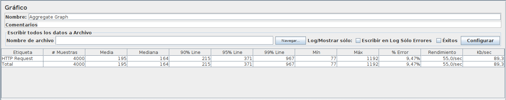

Regarding the test coverage of the application, some [test batteries](https://github.com/Rubru94/tfm-springboot/tree/master/src/test/java/tfm/springboot) have been proposed that share functionality, but have different nature of execution.

- [Integration test](../src/test/java/tfm/springboot/mockmvc/ControllerIntegrationTest.java) using ***MockMVC***

- [E2E test](../src/test/java/tfm/springboot/restassured/ControllerE2ETest.java) with ***Restassured***

- [Unit test](../src/test/java/tfm/springboot/unitTest/ControllerUnitTest.java)

***

Moreover, application use test are also carried out using:

- [**Chaos-Pod-Monkey**](../script/chaos.sh): Code responsible for randomly removing pods from a kubernetes cluster in defined iterations of time (*chaos-test*).

- [**Jmeter's testplan**](../tfm-springboot.jmx): It will launch requests to the main url (*/customer/new*) taking advantage of the chaos situation

As a result, it has been observed that the error rate does not exceed 10%, considering that only two pods from the application and one from the MySQL database are used, which guarantees a fairly robust performance.

